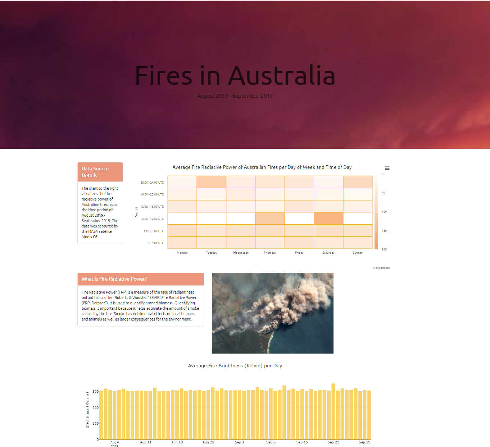

# Fires in Australia August 2019 - September 2019

## Dataset 
The data used was collected by the NASA satellites Terra MODIS and Aqua MODIS. The NASA satellite data used covers the period of August - September 2019. The entire fire season spanned June 2019 - February 2020. Data was acquired from Kaggle: https://www.kaggle.com/carlosparadis/fires-from-space-australia-and-new-zeland

## Data Cleaning and Transformation
The CSV of the data was loaded into jupyter notebook as a dataframe. We looped through the data and added new columns for the day of the week and time of day (bins). We then created a separate dataframe that grouped the dataset by day of week and time of day. For the purpose of the high charts heat map visualization x and y value columns were added that represented the x and y values of day of week and time of day.

## Database and Flask
From jupyter notebook the clean data was exported to CSVs. We then created two databases in SQLite to hold the larger dataset and the grouped data. In our python app we then connected to the database and created flask app routes for each dataset. The app route returns the data in json format. We created app routes for each visualization. The app routes render each visualizations HTML index. 

NOTE: Installing simplejson is required for data to load properly.

## Visualizations
Our visulizaions were displayed on our homepage:

The NASA satellites collected data on the brightness of the fire in Kelvin. For each day the satellites collected hundreds of brightness data points by latitude and longitude. For this chart we took the average brightness per day. This was not specific to a particular location in Australia but an average across locations. We expected to see some variation in brightness of the fire but there was very little variation in average fire brightness. 

Averaging the values by day may have not been the best choice to analyze this data. When we look at the raw data there is a range in the brightness of the fire with the max brightness being 504 Kelvin and the minimum being 300 Kelvin. A better way to look at this data would have been by latitude and longitude as the fire brightness varied more by location rather than day. Our original plan was to create a heatmap of the fire brightness.

 For our second visualization we choose to use the javascript library High Chart's heatmap. We grouped the fire radiative power by day of week and time of day to see if there were any patterns in the radiative power by weekday or time of day.

